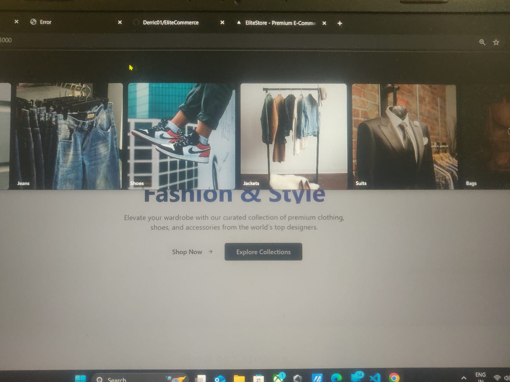
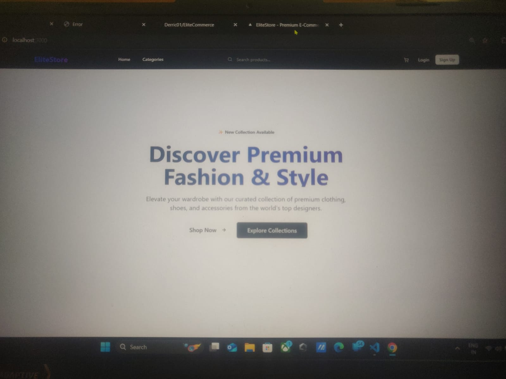

# 🛍️ EliteCommerce - Premium E-Commerce Platform

A modern, full-stack e-commerce platform built with Next.js, Node.js, and MongoDB. Features a premium UI design, comprehensive admin dashboard, and seamless shopping experience.



## ✨ Features

### 🛒 **Customer Experience**
- **Modern UI Design** - Premium, responsive design with Tailwind CSS
- **Product Browsing** - Browse by categories with advanced filtering
- **Shopping Cart** - Add, remove, and manage cart items
- **Secure Checkout** - Stripe payment integration
- **User Accounts** - Registration, login, and order history
- **Wishlist** - Save favorite products
- **Real-time Updates** - Dynamic cart and inventory updates

### 📊 **Admin Dashboard**
- **Product Management** - Add, edit, delete, and feature products
- **Order Management** - View and manage customer orders
- **Analytics** - Sales analytics and performance metrics
- **User Management** - View customer information
- **Coupon System** - Create and manage discount coupons



## 🏗️ **Technology Stack**

### **Frontend (Next.js 15)**
- **Framework:** Next.js 15 with TypeScript
- **Styling:** Tailwind CSS + Shadcn/UI components
- **State Management:** Zustand
- **Animations:** Framer Motion
- **HTTP Client:** Axios
- **Authentication:** JWT with HTTP-only cookies

### **Backend (Node.js)**
- **Framework:** Express.js
- **Database:** MongoDB with Mongoose
- **Authentication:** JWT tokens
- **File Upload:** Multer + Cloudinary
- **Payment:** Stripe integration
- **Caching:** Redis (optional)
- **Security:** bcryptjs, CORS, cookie-parser

## 🚀 **Quick Start**

### **Prerequisites**
- Node.js 18+ 
- MongoDB (local or Atlas)
- Git

### **1. Clone the Repository**
```bash
git clone https://github.com/Derric01/EliteCommerce.git
cd EliteCommerce
```

### **2. Backend Setup**
```bash
cd backend
npm install

# Create .env file
cp .env.example .env
# Edit .env with your configuration
```

**Required Environment Variables (.env):**
```env
PORT=5000
MONGO_URI=your_mongodb_connection_string
ACCESS_TOKEN_SECRET=your_access_secret
REFRESH_TOKEN_SECRET=your_refresh_secret
CLOUDINARY_CLOUD_NAME=your_cloudinary_name
CLOUDINARY_API_KEY=your_cloudinary_key
CLOUDINARY_SECRET_KEY=your_cloudinary_secret
STRIPE_SECRET_KEY=your_stripe_secret
CLIENT_URL=http://localhost:3001
```

**Start Backend Server:**
```bash
npm start
# or for development
npm run dev
```

### **3. Frontend Setup**
```bash
cd frontend_nextjs
npm install

# Create .env.local file
cp .env.local.example .env.local
# Edit with your configuration
```

**Required Environment Variables (.env.local):**
```env
NEXT_PUBLIC_API_URL=http://localhost:5000/api
NEXT_PUBLIC_STRIPE_PUBLISHABLE_KEY=your_stripe_publishable_key
```

**Start Frontend Server:**
```bash
npm run dev
```

### **4. Database Setup**
```bash
# Create admin user
cd backend
node scripts/createAdmin.js

# Add sample products
node scripts/createSampleProducts.js
```

## 📱 **Application Screenshots**

### **Homepage with Featured Products**
The homepage showcases featured products with a modern, clean design and smooth animations.

### **Category Pages**
Browse products by category with filtering options and different view modes (grid/list).

### **Admin Dashboard**
Comprehensive admin panel for managing products, orders, and analytics.

## 🛠️ **Project Structure**

```
EliteCommerce/
├── backend/                    # Node.js backend
│   ├── controllers/           # Route controllers
│   ├── models/               # Database models
│   ├── routes/               # API routes
│   ├── middleware/           # Custom middleware
│   ├── lib/                  # Utility libraries
│   ├── scripts/              # Database scripts
│   └── server.js             # Main server file
│
├── frontend_nextjs/           # Next.js frontend
│   ├── src/
│   │   ├── app/              # Next.js 15 app directory
│   │   ├── components/       # React components
│   │   ├── stores/           # Zustand stores
│   │   └── lib/              # Utility functions
│   ├── public/               # Static assets
│   └── package.json
│
└── README.md
```

## 🔧 **Available Scripts**

### **Backend**
- `npm start` - Start production server
- `npm run dev` - Start development server with nodemon
- `node scripts/createAdmin.js` - Create admin user
- `node scripts/createSampleProducts.js` - Add sample products
- `node scripts/listUsers.js` - List all users

### **Frontend**
- `npm run dev` - Start development server
- `npm run build` - Build for production
- `npm run start` - Start production server
- `npm run lint` - Run ESLint

## 🎯 **Key Features Implementation**

### **Authentication & Authorization**
- JWT-based authentication with refresh tokens
- Protected routes and admin-only access
- Secure HTTP-only cookies

### **Product Management**
- CRUD operations for products
- Image upload with Cloudinary
- Category-based organization
- Featured products system

### **Shopping Cart & Checkout**
- Persistent cart with local storage sync
- Real-time inventory updates
- Stripe payment integration
- Order tracking and history

### **Admin Dashboard**
- Sales analytics with charts
- Product management interface
- Order management system
- User activity monitoring

## 🔐 **Security Features**
- Password hashing with bcryptjs
- JWT token validation
- CORS protection
- Input validation and sanitization
- Protected API routes

## 🌐 **API Endpoints**

### **Authentication**
- `POST /api/auth/signup` - User registration
- `POST /api/auth/login` - User login
- `POST /api/auth/logout` - User logout
- `POST /api/auth/refresh-token` - Refresh access token

### **Products**
- `GET /api/products` - Get all products (admin)
- `GET /api/products/featured` - Get featured products
- `GET /api/products/category/:category` - Get products by category
- `GET /api/products/:id` - Get single product
- `POST /api/products` - Create product (admin)
- `PATCH /api/products/:id` - Toggle featured status (admin)
- `DELETE /api/products/:id` - Delete product (admin)

### **Cart**
- `GET /api/carts` - Get user cart
- `POST /api/carts` - Add to cart
- `DELETE /api/carts` - Clear cart
- `PUT /api/carts/:id` - Update cart item

### **Orders & Payments**
- `POST /api/payments/create-checkout-session` - Create Stripe session
- `POST /api/payments/checkout-success` - Handle successful payment
- `GET /api/users/orders` - Get user orders

## 🚧 **Development Notes**

### **Redis Caching (Optional)**
The application includes optional Redis caching for improved performance. If Redis is not available, the app will run with a mock client without caching functionality.

### **Image Storage**
Product images are stored using Cloudinary. Make sure to configure your Cloudinary credentials in the environment variables.

### **Database**
The application uses MongoDB. You can use either a local MongoDB instance or MongoDB Atlas cloud service.

## 🤝 **Contributing**
1. Fork the repository
2. Create a feature branch (`git checkout -b feature/AmazingFeature`)
3. Commit your changes (`git commit -m 'Add some AmazingFeature'`)
4. Push to the branch (`git push origin feature/AmazingFeature`)
5. Open a Pull Request

## 📝 **License**
This project is licensed under the MIT License - see the [LICENSE](LICENSE) file for details.

## 👨‍💻 **Author**
**Derric Samson**
- GitHub: [@Derric01](https://github.com/Derric01)
- Project: [EliteCommerce](https://github.com/Derric01/EliteCommerce)

## 🙏 **Acknowledgments**
- Next.js team for the amazing framework
- Tailwind CSS for the utility-first CSS framework
- Shadcn/UI for the beautiful component library
- MongoDB for the flexible database solution
- Stripe for secure payment processing

---

⭐ **Star this repository if you found it helpful!**
